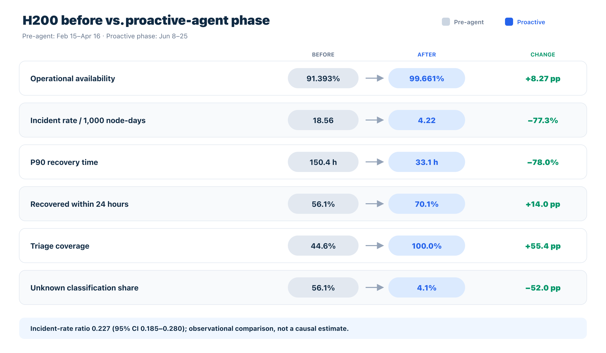

# Incidara

### A Multi-Agent AI System for Production GPU Fleet Reliability

Incidara is a production multi-agent system for site reliability engineering on large GPU fleets. It decomposes the infrastructure-failure lifecycle across specialized **detection, triage, repair, recycler, and feedback agents**, with an operational **job-incident workflow** for training failures and an **attention agent** for work requiring human judgment.

Each agent runs with scoped permissions, a curated skill library, MCP tool access, shared evidence persistence, and explicit approval gates for high-risk actions. The Incidara Console provides the task-control and interaction layer: task submission, schedules, live sessions, approvals, reports, usage, and fleet dashboards.

> The accompanying production study is observational. Reported improvements are temporal associations, not causal estimates. See [the full system and evaluation report](docs/incidara-agent-sre.md).

## Highlights

- **Complete node-failure lifecycle** — proactive detection, evidence-driven triage, repair, validation, reallocation, and outcome feedback.
- **Policy-bounded autonomy** — routine, reversible actions can run automatically; destructive or high-blast-radius actions require approval.
- **Role-scoped MCP tools** — diagnosis agents cannot invoke operations-only tools even if the model requests them.
- **Evidence-first handoffs** — investigation artifacts persist across agents so repair does not repeat triage work.
- **Self-improving operations** — completed RMA outcomes are reconciled with findings and used to improve detection rules and skills.
- **Training-job incident workflow** — log triage, cross-source evidence, controlled reproduction, recovery, and RCA closeout.
- **Stateful agent runtime** — multi-session HTTP gateways, SSE event streaming, permission waits, interruption, and crash recovery.
- **Human control plane** — the Incidara Console exposes tasks, transcripts, tool calls, approvals, schedules, metrics, and reports.
- **Dependency-aware delivery** — CI maps changed paths to affected services, rebuilds only those images, deploys them, and checks health.

See the [Incidara roadmap](docs/roadmap.md) for completed foundations, active milestones, dependencies, and exit criteria.

## Production results

A staged 131-day rollout covered **1,278 NVIDIA H200 nodes**, **152 racks**, and **145,860.5 observed node-days**.

| Metric | Pre-agent | Proactive-agent | Change |
|---|---:|---:|---:|
| Operational availability | 91.393% | **99.661%** | **+8.268 pp** |
| Incidents / 1,000 node-days | 18.564 | **4.217** | **−77.3%** |
| P90 recovery time | 150.4 h | **33.1 h** | **−78.0%** |
| Recovered within 72 h | 84.1% | **100.0%** | **+15.9 pp** |
| Triage coverage | 44.6% | **100.0%** | **+55.4 pp** |
| Unknown classification share | 56.1% | **4.1%** | **−52.0 pp** |



The incident-rate ratio was **0.227** (95% CI 0.185–0.280). The rollout was not randomized, fleet composition and workload changed over time, and incident-to-agent-action linkage was incomplete. The results therefore describe association rather than proof that agents alone caused the change.

- [Full report](docs/incidara-agent-sre.md)
- [Aggregate metrics](docs/evaluation/metrics.csv)
- [Reproducible figure generator](docs/evaluation/generate_figures.py)

## How it works

```text
┌─────────────────────────────────────────────────────────────┐
│ Incidara Console — tasks, sessions, approvals, dashboards   │
└──────────────────────┬──────────────────────────────────────┘
                       │ REST + SSE
┌──────────────────────▼──────────────────────────────────────┐
│ Task Control — auth, queue, schedules, reconciliation       │
└──────────────────────┬──────────────────────────────────────┘
                       │ HTTP + SSE
┌──────────────────────▼──────────────────────────────────────┐
│ Agent Gateway — sessions, events, persistence, permissions  │
├──────────┬──────────┬──────────┬──────────┬─────────────────┤
│Detection │ Triage   │ Repair   │ Recycler │ Feedback        │
│          │          │          │          │                 │
│ Job-incident workflow                         Attention     │
└────┬─────┴────┬─────┴────┬─────┴────┬─────┴──────┬──────────┘
     │          │          │          │            │
┌────▼──────────▼──────────▼──────────▼────────────▼──────────┐
│ MCP tools — node operations, patrol, evidence, feedback,    │
│ switch operations, user reports, platform APIs and data     │
└─────────────────────────────────────────────────────────────┘
```

### Lifecycle agents

| Component | Responsibility | Permission boundary |
|---|---|---|
| **Detection** | Monitor patrol findings, switches, telemetry, and user reports; correlate signals and create investigation work | Diagnosis/read + alert |
| **Triage** | Gather GPU, kernel, network, job, BMC, and historical evidence; classify hardware, platform, or unknown | Diagnosis |
| **Repair** | Confirm the diagnosis, prepare repair/RMA evidence, execute platform fixes, and trigger validation | Operations; RMA requires approval |
| **Recycler** | Track repair tickets, validate completed work, and return healthy nodes to service | Operations |
| **Feedback** | Reconcile outcomes, identify misclassification patterns, patch skills/rules, and monitor the result | Feedback; patches require approval |
| **Job incident** | Run log triage → system evidence → reproduction → recovery → RCA closeout | Diagnosis, then evidence-gated recovery |
| **Attention** | Report ambiguous, blocked, unsafe, and approval-required work | Report-only |

### MCP servers

MCP server names are deployment contracts and remain unchanged:

| Server | Responsibility |
|---|---|
| `patrol-cron` | Collector and rule lifecycle, findings, verdicts, replay, and scheduled detection |
| `node-operations` | Platform/node queries, SSH and BMC probes, state transitions, and controlled actions |
| `agent-evidence` | Persistent investigation evidence shared between agents |
| `agent-feedback` | RMA case memory, reconciliation, analysis problems, and learning history |
| `switch-operations` | Switch inventory, telemetry, logs, and commands |
| `feishu-bitable` | User-submitted infrastructure reports |

`node-operations` exposes different tool sets for `readonly`, `diagnosis`, `ops`, and `feedback` roles. Permission is enforced by tool availability rather than prompt instructions alone.

## Usage

Incidara is an integrated infrastructure system. A complete deployment requires access to the target platform, databases, network/BMC endpoints, model provider, ticket service, and any enabled report integrations. The checked-in configuration contains placeholders only.

### 1. Prerequisites

- Linux deployment host with Docker Engine and Docker Compose
- Python 3.10+ with `PyYAML` and `Jinja2`
- Node.js 22+ for local Console/runtime development
- SSH agent/socket available to agents that probe infrastructure
- PostgreSQL or the included database services
- Credentials for the model provider and enabled platform integrations

### 2. Install development dependencies

```bash
git clone https://github.com/yukirora/incidara.git
cd incidara
make install
```

### 3. Configure the Console registry

```bash
cp console/config/agents.yaml.example console/config/agents.yaml
cp console/config/groups.yaml.example console/config/groups.yaml
```

Edit the files to define agent gateways and access groups. Runtime configuration files are ignored by Git.

### 4. Configure the deployment

```bash
cp compose/config.yaml.example compose/config.yaml
$EDITOR compose/config.yaml
```

At minimum, replace every `CHANGE_ME` value used by the services you enable. The template retains the existing platform contracts, including `LTP_*`, Codeup, Feishu, ticket, OSS, SSH/BMC, PostgreSQL, and model-provider settings.

Never commit `compose/config.yaml` or generated `.env` files.

### 5. Validate and render Compose

```bash
.venv/bin/python compose/render.py --check
.venv/bin/python compose/render.py

cd compose/rendered
docker compose config
docker compose config --services
```

The renderer creates:

```text
compose/rendered/
├── docker-compose.yml
├── databases.yml
├── mcp-servers.yml
├── agents.yml
├── chat-ui.yml
├── backup.yml
└── <service>.env
```

### 6. Start Incidara

From `compose/rendered/`:

```bash
docker compose up -d --build
```

Or bring up the stack in layers:

```bash
# State
docker compose up -d agent-db chat-ui-db

# MCP tools
docker compose up -d \
  agent-evidence agent-feedback agent-feedback-write \
  patrol-cron job-patrol switch-operations \
  node-ops-diagnosis node-ops-feedback node-ops-ops

# Agents
docker compose up -d \
  detection-agent triage-agent repair-agent \
  recycler-agent feedback-agent attention-agent

# Console
docker compose up -d incidara-console-api incidara-console-web
```

Check health:

```bash
docker compose ps
docker compose logs --tail=100 <service>
```

### 7. Use the agents

Use the Console to create tasks or schedules against a configured gateway. Example prompts:

```text
Scan the cluster for unjudged findings and collector anomalies.
Triage all triaged_unknown nodes.
Investigate node <hostname> and classify the fault.
Check completed repair tickets and recycle eligible nodes.
Analyze completed RMA outcomes and identify recurring misclassifications.
Investigate training job <job-name> using the job-incident workflow.
```

High-risk tool calls enter `waiting_input` until an authorized user approves or denies them in the Console.

### 8. Run validation

```bash
make verify
```

The verification target checks repository scope and private-data patterns, validates the Compose renderer, runs Console and agent-runtime tests, runs MCP unit tests, compiles Python sources, and builds the TypeScript applications.

## CI and incremental deployment

The retained Codeup pipeline performs deployment without rebuilding unrelated services:

```text
merge
  → ci/detect-changed-services.sh
  → ci/service-path-map.tsv
  → ci/build-and-deploy.sh
  → compose/render.py
  → build/recreate affected services
  → health verification
```

Generate the encrypted `CONFIG_YAML_B64` pipeline value from a local deployment configuration:

```bash
bash ci/generate-config-b64.sh compose/config.yaml
```

`ci/flow.yml` contains placeholders for the Codeup repository connection and private runner group. Configure those values in the CI system; do not commit runner credentials or the generated base64 configuration.

## Repository layout

```text
incidara/
├── ci/                         # changed-service detection and deployment
├── compose/                    # config renderer and service templates
├── infra/
│   ├── backup/agent/           # agent workspace/session backup
│   └── postgresql/             # schemas and pgBackRest support
├── incidara_agents/
│   ├── agents/                 # runtime and lifecycle agent images
│   ├── mcp_servers/            # role-scoped tools
│   ├── skills/                 # operational workflows and runbooks
│   └── ltp-platform/           # storage/PostgreSQL SDK integration
├── console/                    # React UI and Node task-control server
└── docs/                       # system report and design documentation
```

## Documentation

Start with [the documentation index](docs/README.md).

- [System and production evaluation](docs/incidara-agent-sre.md)
- [Roadmap](docs/roadmap.md)
- [Mission and design principles](docs/mission.md)
- [Agent workflow protocol](docs/agent-workflow-protocol.md)
- [Detection agent](docs/detection-agent.md)
- [Detection feedback loop](docs/detection-feedback-loop.md)
- [Unified detection](docs/unified-detection.md)
- [Deployment](docs/deployment.md)
- [Backup design](docs/backup.md)

## Study limitations

The production rollout was not randomized. Fleet size, fleet age, workload, staffing, and operating procedures changed during the study. Classification also changed as agents increased triage coverage. Direct finding-to-repair outcome linkage was incomplete. These limitations are why the evaluation reports observational association rather than causal effect.

## Project status and license

The [roadmap](docs/roadmap.md) separates completed production foundations from the remaining orchestration, memory, exception-learning, reproduction, training-job, and autonomy milestones.

This repository is currently private while ownership, contributor approval, dependency review, and licensing are completed. No public license has been granted yet.
