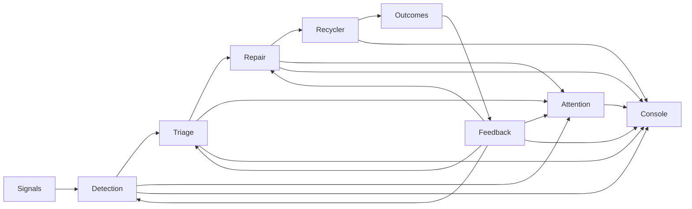

# Incidara

**Agentic incident response for AI infrastructure.**

Incidara coordinates specialized agents that detect infrastructure problems, investigate evidence, perform safety-gated remediation, return repaired resources to service, and learn from operational outcomes. The Incidara Console provides a shared view of tasks, sessions, tool calls, approvals, reports, and agent health.

> **Publication status:** this is a private preparation repository. No public license has been granted yet. Confirm ownership and choose a license before making it public.

## Incident loop



## Included scope

### Agents

- **Detection** — scans rules, findings, collectors, switches, and user reports.
- **Triage** — gathers evidence and classifies infrastructure incidents.
- **Repair** — coordinates policy-controlled repair actions.
- **Recycler** — validates repaired nodes and returns them to service.
- **Feedback** — analyzes RMA and operational outcomes to improve rules and skills.
- **Attention** — reports ambiguous, blocked, or approval-required work.
- **Claude agent runtime** — shared HTTP/SSE runtime used by the agents.

### MCP servers

Existing MCP server names are intentionally unchanged:

- `patrol-cron`
- `node-operations`
- `agent-evidence`
- `agent-feedback`
- `switch-operations`
- `feishu-bitable`

### Console

`console/` contains the Incidara Console React client, Node.js API, PostgreSQL migrations, authentication, authorization, schedules, task history, reports, and usage views.

## Not included

Incidara intentionally excludes unrelated model optimization, reproduction, inference evaluation, job evaluation, TCO, benchmark datasets, and platform source trees.

## Repository layout

```text
incidara/
├── incidara_agents/
│   ├── agents/          # runtime plus six operational agents
│   ├── mcp_servers/     # unchanged MCP server names
│   └── skills/          # only skills used by the operational loop
├── console/             # Incidara Console client and server
├── docs/
├── scripts/
├── compose.yaml         # local Console + PostgreSQL
└── Makefile
```

See [`docs/architecture.md`](docs/architecture.md) for component relationships.

## Run the Console locally

The local stack starts the Console and PostgreSQL. Agent gateways may remain offline while developing the UI.

```bash
cp .env.example .env
# Replace POSTGRES_PASSWORD and SESSION_SECRET in .env
docker compose up --build
```

Create the first local administrator:

```bash
curl -X POST http://localhost:3001/api/auth/signup \
  -H 'content-type: application/json' \
  -d '{"email":"admin@example.com","password":"change-this-password","name":"Admin"}'
```

Then open <http://localhost:3001>.

## Develop and verify

Node dependencies are installed only inside `console/`:

```bash
make install
make verify
```

`make verify` runs the repository publication checks, Console tests/build, and Python syntax compilation.

## Deploying agents

Agent behavior and existing integrations have been preserved. Real deployments must supply their own environment files, credentials, network access, platform database, agent gateway configuration, and MCP endpoints. Component-specific setup remains in each agent and MCP server directory.

Never commit runtime `.env` files, authentication material, SSH keys, database data, or session transcripts.

## Safety

- Diagnosis and operations use separate MCP permission roles.
- Destructive actions remain behind the existing approval and blast-radius controls.
- The public export does not include live credentials, keys, runtime data, or private Git history.
- Review [`docs/publication.md`](docs/publication.md) before changing the repository to public visibility.

## License

No license has been selected. All rights remain reserved until the code owner approves a public license.
