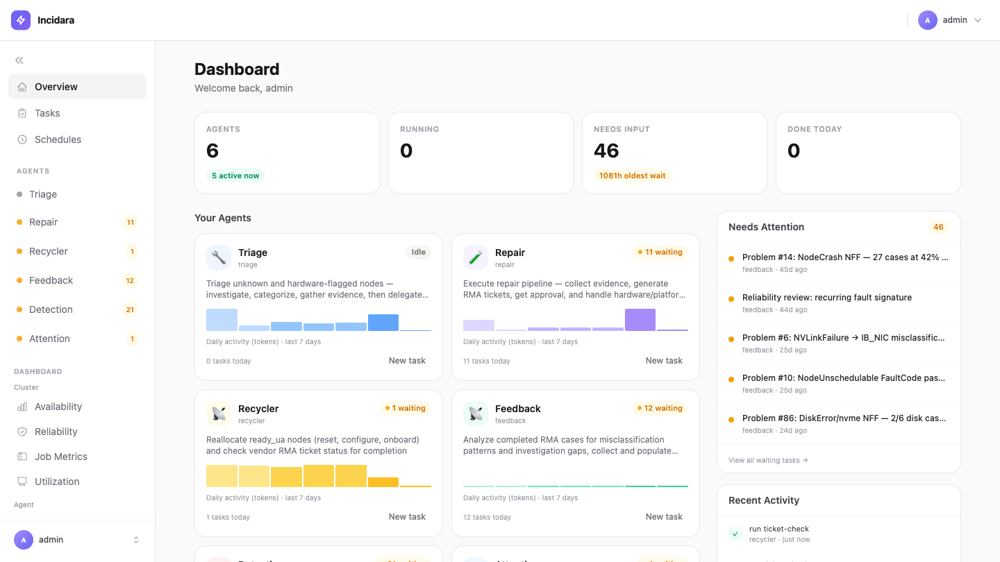

# Incidara

### AI-driven reliability operations for GPU clusters—from raw signal to component-level diagnosis and verified recovery

A distributed training job can fail because of one GPU, one GPU memory device, one PCIe path, one NVLink, one IB port, one switch interface, one disk, an unhealthy node, or a shared platform service. The visible symptom—an Xid, NCCL timeout, `NodeNotReady`, failed validation, or stalled job—rarely identifies the real fault by itself.

Incidara correlates cluster telemetry, job events and logs, node history, `nvidia-smi`, kernel messages, SSH probes, BMC/Redfish/IPMI events, NVLink state, InfiniBand counters, switch interfaces, topology, and repair history. It determines the **smallest fault domain supported by the evidence**, distinguishes hardware faults from platform, workload, and transient failures, and coordinates the response through detection, triage, repair, validation, recycling, and feedback.

This is more than an alerting or node-classification system. Incidara can:

- identify a faulty GPU by index and PCI address from ECC/Xid evidence;
- narrow a communication failure to an NVLink, HCA, IB port, switch interface, or shared fabric path when topology and telemetry permit;
- identify an unhealthy NVMe/disk, filesystem, PSU, fan, DIMM/channel, or other BMC-reported component;
- cordon or drain the containing node, prepare an evidence-backed repair/RMA request, and require approval for high-risk actions;
- validate repaired resources and return them to service;
- reconcile repair outcomes and human corrections with the original decision so rules and skills can improve.

The node reliability loop and proactive detection system are operational today. Component-level identity is captured in evidence and diagnoses, while actions usually remain node-scoped because the scheduler and repair lifecycle operate on nodes. The training-job diagnosis/reproduction skills are included, but their dedicated durable orchestration remains roadmap work.

## Diagnostic scope

| Fault domain | Resolution Incidara can reach today | Closed-loop response | Maturity |
|---|---|---|---|
| **Node** | Hostname, state transition, SKU, management/BMC address, alert window, affected jobs, validation, and repair history | Cordon/drain → triage → repair or revalidation → recycle | Operational |
| **GPU / PCIe** | GPU index, PCI address, model/serial, missing or unresponsive device, Xid sequence, PCIe AER/DPC evidence, and affected job | Quarantine containing node → evidence-gated GPU/RMA path → validation → recycle | Operational |
| **GPU memory** | Specific GPU, volatile/aggregate ECC counts, DBE/SBE, row-remap event or exhaustion, and primary/secondary Xids | Cordon → GPU-memory RMA evidence → component outcome → replay | Operational |
| **NVLink / NVSwitch** | GPU and link number/state, NVLink Xid/error mask, Fabric Manager state, and NVSwitch/tray failure pattern | Drain affected node → GPU/NVSwitch repair path → NVLink/NCCL validation | Operational at node/fabric scope |
| **HCA / IB link** | HCA such as `mlx5_3`, PCI device, physical port, state/rate, incident-window counter deltas, and mapped switch interface when topology permits | Contain node or shared path → NIC/cable/optic/switch repair → IB/NCCL validation | Operational; optic identity is coarse |
| **Switch / fabric** | Switch, affected interface, symbol/CRC/FCS delta, link-flap timeline, downstream nodes, and UFM/OpenSM events | Alert or cordon downstream nodes → path maintenance → verify counters and workloads | Operational for supported switch types |
| **Storage** | Disk/NVMe device, SMART/NVMe state, media errors, filesystem/mount evidence, I/O errors, or software disk pressure | Hardware RMA or platform cleanup/mount repair → storage validation → recycle | Operational |
| **CPU / DIMM / BMC** | Inventory mismatch and BMC/SEL/Redfish evidence for DIMM/channel, PSU, fan, thermal, PCIe, NIC, GPU, or FRU | Hardware repair or platform configuration → validation → recycle | Evidence-dependent |
| **Platform software** | Device-plugin registration, stale allocation state, kubelet/service failure, mount/image failure, configuration drift, and scheduler conditions | Repair software/configuration without unnecessary hardware RMA → revalidate | Operational |
| **Training job** | Job and attempt; the included workflow models rank → PID → GPU → node → HCA → path and first versus propagated errors | Job isolation/recovery → checkpoint verification → RCA → learning | Skills implemented; durable orchestration incomplete |

The **diagnostic scope** may be a GPU, link, port, disk, component, path, or service. The **action scope** is deliberately conservative: Incidara acts on the smallest safe operational unit exposed by the platform, most often a job or node, and escalates when the physical boundary is uncertain.

> The accompanying production study is observational. Reported improvements are temporal associations, not causal estimates. See [the full system and evaluation report](docs/incidara-agent-sre.md).

## Highlights

- **Complete node-failure lifecycle** — proactive detection, evidence-driven triage, repair, validation, reallocation, and outcome feedback.
- **Policy-bounded autonomy** — routine, reversible actions can run automatically; destructive or high-blast-radius actions require approval.
- **Role-scoped MCP tools** — diagnosis agents cannot invoke operations-only tools even if the model requests them.
- **Evidence-first handoffs** — investigation artifacts persist across agents so repair does not repeat triage work.
- **Self-improving operations** — completed RMA outcomes are reconciled with findings and used to improve detection rules and skills.
- **Training-job incident workflow** — log triage, cross-source evidence, controlled reproduction, recovery, and RCA closeout.
- **Stateful agent runtime** — multi-session HTTP gateways, SSE event streaming, permission waits, interruption, and crash recovery.
- **Human control plane** — the Incidara Console exposes tasks, transcripts, tool calls, approvals, schedules, metrics, and reports.
- **Dependency-aware delivery** — CI maps changed paths to affected services, rebuilds only those images, deploys them, and checks health.

See the [Incidara roadmap](docs/roadmap.md) for completed foundations, active milestones, dependencies, and exit criteria.

## Console demo

[](docs/demo/incidara-console.mp4)

[▶ Watch the two-minute Incidara Console demo](docs/demo/incidara-console.mp4)

The demo follows a real historical Triage → Repair handoff through diagnosis, delegation, RMA preparation, and human approval, then shows schedules, access controls, agent metrics, and availability. Production identities and hardware details are masked; schedules use sanitized existing definitions, and Admin records use a representative browser-only view. Browser writes were blocked after login, so no production task, schedule, permission, or admin state was changed.

## Production results

A staged 131-day observational rollout covered a production fleet of **1,000+ GPU nodes** across **100+ racks**, totaling more than **145,000 observed node-days**.

| Metric | Pre-agent | Proactive-agent | Change |
|---|---:|---:|---:|
| Operational availability | 91.393% | **99.661%** | **+8.268 pp** |
| Incidents / 1,000 node-days | 18.564 | **4.217** | **−77.3%** |
| P90 recovery time | 150.4 h | **33.1 h** | **−78.0%** |
| Recovered within 72 h | 84.1% | **100.0%** | **+15.9 pp** |
| Triage coverage | 44.6% | **100.0%** | **+55.4 pp** |
| Unknown classification share | 56.1% | **4.1%** | **−52.0 pp** |

The incident-rate ratio was **0.227** (95% CI 0.185–0.280). The rollout was not randomized, and fleet composition, workload, staffing, and operating procedures changed during the study. These results describe temporal association rather than proving that Incidara alone caused the improvement.

See the [full evaluation](docs/incidara-agent-sre.md) for methodology, metric definitions, staged results, and validity limits. Aggregate values are available in [`docs/evaluation/metrics.csv`](docs/evaluation/metrics.csv).

## How it works

```text
┌─────────────────────────────────────────────────────────────┐
│ Incidara Console — tasks, sessions, approvals, dashboards   │
└──────────────────────┬──────────────────────────────────────┘
                       │ REST + SSE
┌──────────────────────▼──────────────────────────────────────┐
│ Task Control — auth, queue, schedules, reconciliation       │
└──────────────────────┬──────────────────────────────────────┘
                       │ HTTP + SSE
┌──────────────────────▼──────────────────────────────────────┐
│ Agent Gateway — sessions, events, persistence, permissions  │
├──────────┬──────────┬──────────┬──────────┬─────────────────┤
│Detection │ Triage   │ Repair   │ Recycler │ Feedback        │
│          │          │          │          │                 │
│ Job-incident workflow                         Attention     │
└────┬─────┴────┬─────┴────┬─────┴────┬─────┴──────┬──────────┘
     │          │          │          │            │
┌────▼──────────▼──────────▼──────────▼────────────▼──────────┐
│ MCP tools — node operations, patrol, evidence, feedback,    │
│ switch operations, user reports, platform APIs and data     │
└─────────────────────────────────────────────────────────────┘
```

### Lifecycle agents

| Component | Responsibility | Permission boundary |
|---|---|---|
| **Detection** | Monitor patrol findings, switches, telemetry, and user reports; correlate signals and create investigation work | Diagnosis/read + alert |
| **Triage** | Gather GPU, kernel, network, job, BMC, and historical evidence; classify hardware, platform, or unknown | Diagnosis |
| **Repair** | Confirm the diagnosis, prepare repair/RMA evidence, execute platform fixes, and trigger validation | Operations; RMA requires approval |
| **Recycler** | Track repair tickets, validate completed work, and return healthy nodes to service | Operations |
| **Feedback** | Reconcile outcomes, identify misclassification patterns, patch skills/rules, and monitor the result | Feedback; patches require approval |
| **Job incident** | Run log triage → system evidence → reproduction → recovery → RCA closeout | Diagnosis, then evidence-gated recovery |
| **Attention** | Report ambiguous, blocked, unsafe, and approval-required work | Report-only |

### MCP servers

MCP server names are deployment contracts and remain unchanged:

| Server | Responsibility |
|---|---|
| `patrol-cron` | Collector and rule lifecycle, findings, verdicts, replay, and scheduled detection |
| `node-operations` | Platform/node queries, SSH and BMC probes, state transitions, and controlled actions |
| `agent-evidence` | Persistent investigation evidence shared between agents |
| `agent-feedback` | RMA case memory, reconciliation, analysis problems, and learning history |
| `switch-operations` | Switch inventory, telemetry, logs, and commands |
| `feishu-bitable` | User-submitted infrastructure reports |

`node-operations` exposes different tool sets for `readonly`, `diagnosis`, `ops`, and `feedback` roles. Permission is enforced by tool availability rather than prompt instructions alone.

## Closed-loop case examples

These are sanitized production failure patterns represented by Incidara’s rules, investigation methods, repair workflow, and replay tests. Identifiers are anonymized; the final decision always depends on the evidence observed for that incident.

| Case | Initial symptom | Final fault resolution | Closed-loop result |
|---|---|---|---|
| GPU bus failure | `nvidia-smi` timeout / Xid 79 | GPU 2, PCI `0000:ab:00.0` | Node cordoned → GPU repair → validation → recycle |
| GPU memory failure | Validation ECC failure | GPU 4 uncorrectable ECC / Xid 48 | GPU RMA → replacement outcome → replay |
| NVMe failure | `DiskError` / `NodeNotReady` | `/dev/nvme3n1` media failure or platform disk pressure | Hardware replacement or platform repair → storage validation |
| IB optical-link failure | NCCL/UCX timeout | `mlx5_3` port 1 → switch `IB1/17` → optic/path | Link repair → path validation → diagnosis feedback |

<details>
<summary><strong>Case 1 — Locate a failed GPU and PCIe path</strong></summary>

### Initial symptom

```text
nvidia-smi does not complete within the bounded timeout
NVRM Xid 79: GPU 0000:ab:00.0 has fallen off the bus
```

A node-level alert alone cannot distinguish a driver issue, temporary reset, PCIe path failure, GPU failure, or broader node crash.

### Evidence and resolution

```text
1. Map alert and affected workload to node-gpu-01.
2. Compare expected GPU inventory with currently visible devices.
3. Run timeout-bounded nvidia-smi and capture its exit status.
4. Read incident-window dmesg for Xid, AER, DPC, PCIe, and NVLink evidence.
5. Map PCI 0000:ab:00.0 to GPU index 2.
6. Check whether the same workload succeeds on healthy GPUs/nodes.
```

Resolved fault object:

```yaml
fault_domain: gpu_pcie
node: node-gpu-01
gpu_index: 2
pci_address: "0000:ab:00.0"
primary_evidence: "Xid 79 before workload failure"
action_scope: node
```

### Action and feedback

```text
cordon/drain node
→ preserve GPU inventory, Xid, PCIe, and workload-impact evidence
→ Repair confirms the failure and prepares a vendor-safe RMA
→ human approves reset/RMA
→ vendor repairs GPU or motherboard path
→ Recycler resets, configures, validates, and reallocates the node
→ Feedback compares the replaced component with the predicted GPU/PCIe fault
```

A GPU replacement matching the diagnosis is `REPAIR_CONFIRMED`; a motherboard replacement may confirm the PCIe domain but refine the predicted component; no reproducible fault becomes NFF feedback.

</details>

<details>
<summary><strong>Case 2 — Isolate a GPU memory failure</strong></summary>

### Initial symptom

```text
validation result: ContainerMayFailDueToGpuDeviceEccError
```

### Evidence and differential diagnosis

```text
Job/validation log
  → identify affected task and node

nvidia-smi per-GPU query
  → GPU 4 has uncorrectable ECC
  → other GPUs do not show the same failure

dmesg timeline
  → Xid 48 double-bit ECC occurs first
  → Xid 45/94 may appear later as secondary effects

row-remap state
  → distinguish a correctable remap event from remap exhaustion/failure
```

Resolved fault object:

```yaml
fault_domain: gpu_memory
node: node-ecc-01
gpu_index: 4
pci_address: "0000:ca:00.0"
primary_xid: 48
ecc_type: uncorrectable_double_bit
action_scope: node
```

### Vendor evidence

```text
GPU index and PCI address
volatile and aggregate ECC counts
primary/secondary Xid sequence with timestamps
validation actual/baseline result
nvidia-smi and dmesg excerpts
vendor-runnable reproduction/validation commands
```

### Closed loop

```text
cordon node → evidence gate → GPU RMA approval → component repair
→ GPU/NVLink/communication validation → recycle
→ reconcile vendor outcome with finding
→ create positive or negative replay evidence
```

Incidara does not treat every Xid as a GPU-memory RMA. It uses the per-device ECC state and primary error sequence to distinguish a concrete memory failure from a transient or propagated symptom.

</details>

<details>
<summary><strong>Case 3 — Distinguish failed NVMe media from platform disk pressure</strong></summary>

### Initial symptom

```text
DiskError, storage validation failure, or NodeNotReady
```

### Evidence

```text
alert/device mapping
lsblk and mount layout
df usage and inode pressure
nvme smart-log / smartctl for the named device
dmesg I/O, controller, timeout, and filesystem errors
service/mount/container state
```

Differential decision:

| Observation | Diagnosis | Response |
|---|---|---|
| `/dev/nvme3n1` reports critical warning, media errors, or repeated controller/I/O failure | Physical NVMe failure | Cordon → disk RMA → replacement → storage validation → recycle |
| Filesystem is full but media health is clean | Platform capacity/cleanup issue | Clean safely → restart affected service if needed → validate |
| Media is healthy but mount/service is stale | Platform mount/service failure | Repair mount/service → validate; no hardware RMA |
| Evidence no longer reproduces and historical data is insufficient | Unknown/transient | Revalidate or escalate; do not invent a disk fault |

Vendor feedback such as “NVMe replaced and storage test passed” confirms the physical diagnosis. Filesystem cleanup or remount is maintenance/configuration feedback and should not inflate hardware-diagnosis accuracy.

</details>

<details>
<summary><strong>Case 4 — Narrow NCCL/UCX failure to an IB optical path</strong></summary>

### Initial symptom and candidates

```text
NCCL timeout
UCX ERROR: ibv_create_ah(...) failed: Connection timed out on mlx5_3
```

Possible causes include job/NCCL configuration, rank desynchronization, GPU/NVLink, HCA, cable/optic, switch interface, shared fabric control, or an RDMA device-plugin problem. Incidara does not classify from the error string alone.

### Job-to-path mapping

```text
Job attempt → first failing rank 5 → node-ib-01 → GPU 2
            → HCA mlx5_3 → physical port 1
            → leaf-07 / IB1/17, only when topology is verified
```

Without verified topology, the maximum supported resolution remains `node-ib-01 / mlx5_3 / port 1`; Incidara must not claim a switch interface.

### Node-side evidence

```text
$ ibstat mlx5_3
CA 'mlx5_3'
    Port 1:
        State: Down
        Physical state: Polling
        Rate: 400

Incident-window deltas:
  LinkDowned:   +3
  SymbolErrors: +214
  RcvErrors:    +41

Kernel:
  mlx5_core 0000:5e:00.0: port module event
  mlx5_3: link down
```

The workflow compares incident-window deltas. A large lifetime counter without a new delta is historical evidence, not proof of the current failure.

### Switch/fabric evidence

```text
Switch: leaf-07
Port: IB1/17
Before incident: Active, symbol errors 0
During incident: Down, symbol-error delta +214

UFM/OpenSM controls:
  no simultaneous ERR 1F07 burst
  no ERR 5430 path-resolution spike
  no multi-switch outage
  no UFM restart
```

### Differential diagnosis

| Candidate | Evidence | Result |
|---|---|---|
| Job/NCCL configuration | Failure follows one physical path, not a software cohort | Weakened |
| GPU/NVLink | No relevant Xid; local NVLink checks healthy | Weakened |
| RDMA device plugin | Physical port is actually Down, not merely absent from `Allocatable` | Rejected |
| Shared UFM/fabric | No same-window multi-job or control-plane event | Weakened |
| HCA/port/path hardware | Node and switch report the same link failure in the same window | Supported |
| Optical module/cable | Physical link is supported; exact replaceable component still needs DOM data or inspection | Suspected |

Resolved fault object:

```yaml
fault_domain: ib_link
node: node-ib-01
hca: mlx5_3
hca_pci: "0000:5e:00.0"
hca_port: 1
switch: leaf-07
switch_port: IB1/17
suspected_component: optical_module_or_cable
confidence: high_for_path_medium_for_exact_component
action_scope: node_or_verified_shared_path
```

### Vendor-facing evidence

```text
HCA mlx5_3, PCI 0000:5e:00.0, port 1
State Down / Physical state Polling / expected rate 400 Gb/s
incident-window LinkDowned, SymbolErrors, and receive-error deltas
matching switch-interface transition and counters
UCX address-handle failure on mlx5_3
approved ibstat/perfquery/ibqueryerrors and communication validation
```

User, job, model, dataset, and internal orchestration identities are removed.

### Vendor outcome and learning

Example sanitized response:

```text
更换光模块后链路恢复正常，IB测试通过
Optical module replaced; link recovered; IB validation passed.
```

If the original diagnosis was the IB path, this is `REPAIR_CONFIRMED`. If Incidara called it NVLink while the vendor repaired an IB optic/NIC, it is `MISCLASSIFIED` and becomes a replay case teaching the workflow to inspect UCX/HCA evidence before labeling an NCCL or `nvlink-sharp` failure as NVLink.

The current feedback vocabulary usually compresses an optical-module replacement into `cable_replace` / `IB_Cable` or `other`. A future component model should distinguish `IB_TRANSCEIVER`, `SWITCH_TRANSCEIVER`, `FIBER`, `DAC_CABLE`, `IB_NIC`, and `SWITCH_PORT` so exact-component accuracy can be measured.

```text
vendor outcome → case_memory → finding reconciliation → trajectory diagnosis
→ taxonomy/rule/skill candidate → replay + healthy counterexample
→ human approval → deploy → monitor recurrence
```

</details>

## Design limitations

| Limitation | Current boundary |
|---|---|
| **Component diagnosis, node/job actuation** | Incidara can identify a specific GPU, PCIe device, NVLink, HCA/IB port, switch interface, or disk, but the platform usually exposes operational actions at node or job scope. The resulting action is therefore commonly cordon, drain, reset, RMA, job recovery, or node reallocation. Physical component replacement is outside Incidara. |
| **Environment-specific integrations** | Incidara is currently built around [LTP Platform](https://github.com/microsoft/ltp-platform) schemas and APIs, Codeup, Feishu, OSS, the ticket system, SSH/BMC access, and fleet-specific hardware conventions. Adapting it to another platform requires new integrations and hardware/runbook calibration; it is not currently a plug-and-play generic AIOps framework. |
| **Bounded rather than unrestricted autonomy** | Incidara automatically handles known operations inside configured permission and blast-radius limits. Destructive, irreversible, novel, or broad actions require human approval or takeover. This safety boundary is intentional. |

Implementation progress—such as unified incident orchestration, reproduction executors, node-regression detection, memory integration, and full training-job service deployment—is tracked in the [roadmap](docs/roadmap.md), not treated as a fundamental design limitation.

## Usage

Incidara is an integrated infrastructure system. A complete deployment requires access to the target platform, databases, network/BMC endpoints, model provider, ticket service, and any enabled report integrations. The checked-in configuration contains placeholders only.

### 1. Prerequisites

- Linux deployment host with Docker Engine and Docker Compose
- Python 3.10+ with `PyYAML` and `Jinja2`
- Node.js 22+ for local Console/runtime development
- SSH agent/socket available to agents that probe infrastructure
- PostgreSQL or the included database services
- Credentials for the model provider and enabled platform integrations

### 2. Install development dependencies

```bash
git clone https://github.com/yukirora/incidara.git
cd incidara
make install
```

### 3. Configure the Console registry

```bash
cp console/config/agents.yaml.example console/config/agents.yaml
cp console/config/groups.yaml.example console/config/groups.yaml
```

Edit the files to define agent gateways and access groups. Runtime configuration files are ignored by Git.

### 4. Configure the deployment

```bash
cp compose/config.yaml.example compose/config.yaml
$EDITOR compose/config.yaml
```

At minimum, replace every `CHANGE_ME` value used by the services you enable. The template retains the existing platform contracts, including `LTP_*`, Codeup, Feishu, ticket, OSS, SSH/BMC, PostgreSQL, and model-provider settings.

Never commit `compose/config.yaml` or generated `.env` files.

### 5. Validate and render Compose

```bash
.venv/bin/python compose/render.py --check
.venv/bin/python compose/render.py

cd compose/rendered
docker compose config
docker compose config --services
```

The renderer creates:

```text
compose/rendered/
├── docker-compose.yml
├── databases.yml
├── mcp-servers.yml
├── agents.yml
├── chat-ui.yml
├── backup.yml
└── <service>.env
```

### 6. Start Incidara

From `compose/rendered/`:

```bash
docker compose up -d --build
```

Or bring up the stack in layers:

```bash
# State
docker compose up -d agent-db chat-ui-db

# MCP tools
docker compose up -d \
  agent-evidence agent-feedback agent-feedback-write \
  patrol-cron job-patrol switch-operations \
  node-ops-diagnosis node-ops-feedback node-ops-ops

# Agents
docker compose up -d \
  detection-agent triage-agent repair-agent \
  recycler-agent feedback-agent attention-agent

# Console
docker compose up -d incidara-console-api incidara-console-web
```

Check health:

```bash
docker compose ps
docker compose logs --tail=100 <service>
```

### 7. Use the agents

Use the Console to create tasks or schedules against a configured gateway. Example prompts:

```text
Scan the cluster for unjudged findings and collector anomalies.
Triage all triaged_unknown nodes.
Investigate node <hostname> and classify the fault.
Check completed repair tickets and recycle eligible nodes.
Analyze completed RMA outcomes and identify recurring misclassifications.
Investigate training job <job-name> using the job-incident workflow.
```

High-risk tool calls enter `waiting_input` until an authorized user approves or denies them in the Console.

### 8. Run validation

```bash
make verify
```

The verification target checks repository scope and private-data patterns, validates the Compose renderer, runs Console and agent-runtime tests, runs MCP unit tests, compiles Python sources, and builds the TypeScript applications.

## CI and incremental deployment

The retained Codeup pipeline performs deployment without rebuilding unrelated services:

```text
merge
  → ci/detect-changed-services.sh
  → ci/service-path-map.tsv
  → ci/build-and-deploy.sh
  → compose/render.py
  → build/recreate affected services
  → health verification
```

Generate the encrypted `CONFIG_YAML_B64` pipeline value from a local deployment configuration:

```bash
bash ci/generate-config-b64.sh compose/config.yaml
```

`ci/flow.yml` contains placeholders for the Codeup repository connection and private runner group. Configure those values in the CI system; do not commit runner credentials or the generated base64 configuration.

## Repository layout

```text
incidara/
├── ci/                         # changed-service detection and deployment
├── compose/                    # config renderer and service templates
├── infra/
│   ├── backup/agent/           # agent workspace/session backup
│   └── postgresql/             # schemas and pgBackRest support
├── incidara_agents/
│   ├── agents/                 # runtime and lifecycle agent images
│   ├── mcp_servers/            # role-scoped tools
│   ├── skills/                 # operational workflows and runbooks
│   └── ltp-platform/           # storage/PostgreSQL SDK integration
├── console/                    # React UI and Node task-control server
└── docs/                       # system report and design documentation
```

## Documentation

- [System architecture and production evaluation](docs/incidara-agent-sre.md)
- [Engineering roadmap](docs/roadmap.md)
- [Deployment, CI, backup, and restore](docs/deployment.md)

Component-specific behavior lives beside the implementation in agent, MCP server, skill, and Console READMEs.

## Study limitations

The production rollout was not randomized. Fleet size, fleet age, workload, staffing, and operating procedures changed during the study. Classification also changed as agents increased triage coverage. Direct finding-to-repair outcome linkage was incomplete. These limitations are why the evaluation reports observational association rather than causal effect.

## Project status and license

The [roadmap](docs/roadmap.md) separates completed production foundations from the remaining orchestration, memory, exception-learning, reproduction, training-job, and autonomy milestones.

This repository is currently private while ownership, contributor approval, dependency review, and licensing are completed. No public license has been granted yet.
